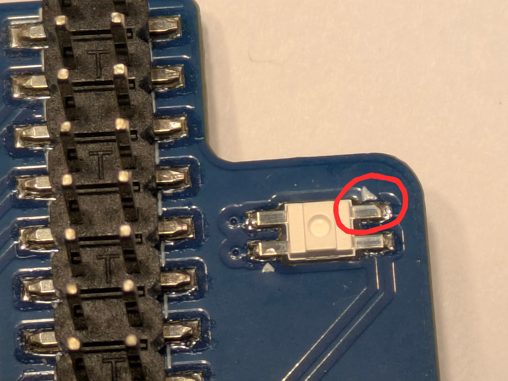
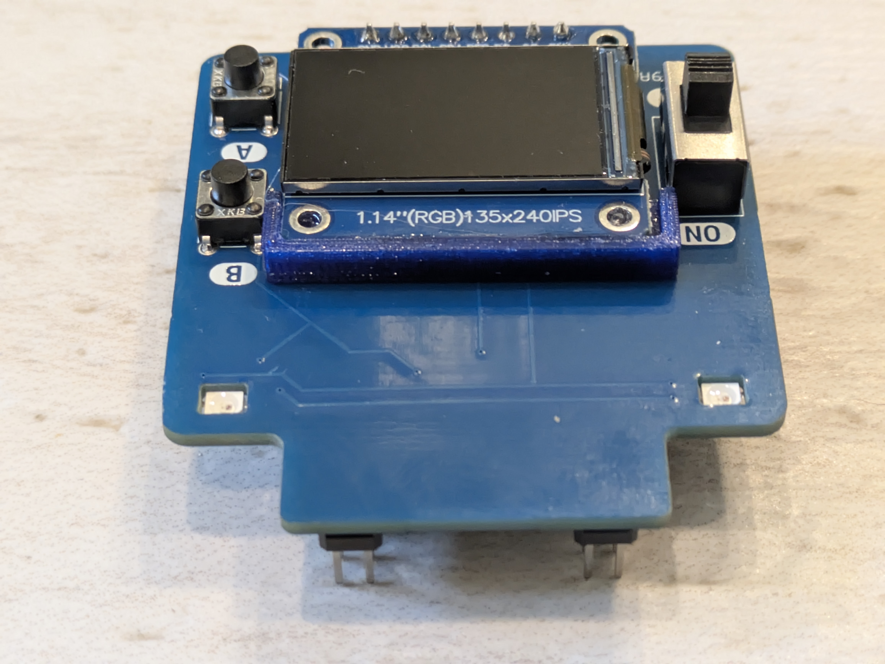
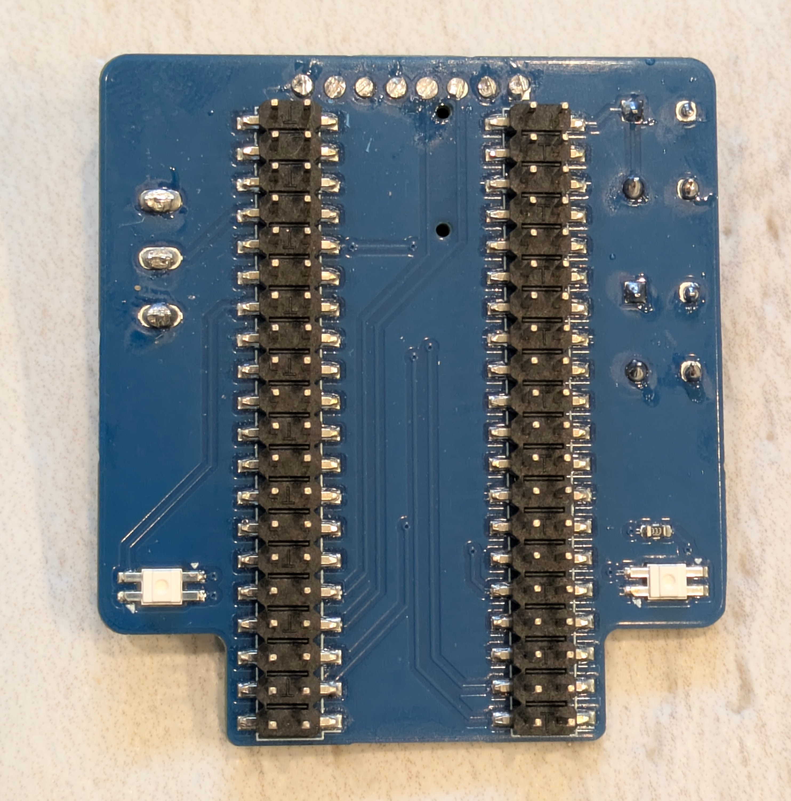

#######################
Board assembly
#######################
All board design files and BOM are in |github| under an open source license. Assemblying the board is 
straightforward - all you need is a decent sodlering iron - but time-consuming (you need to solder 80 pins). 

The Neopixel LEDs are soldered from the bottom of the board; pay attention to orientation 
(one of LED contacts has a corner cut off):

Before soldering the TFT display, 3d print the support (in harware/3d printed folder in github) 
and glue it to the  display (I used contact adhesive for plastics). Be careful with the display, 
they are fragile.

After soldering all components, use flush cutters to trim the pins of the TFT display and the switch protruding 
from the bottom of the board.  

