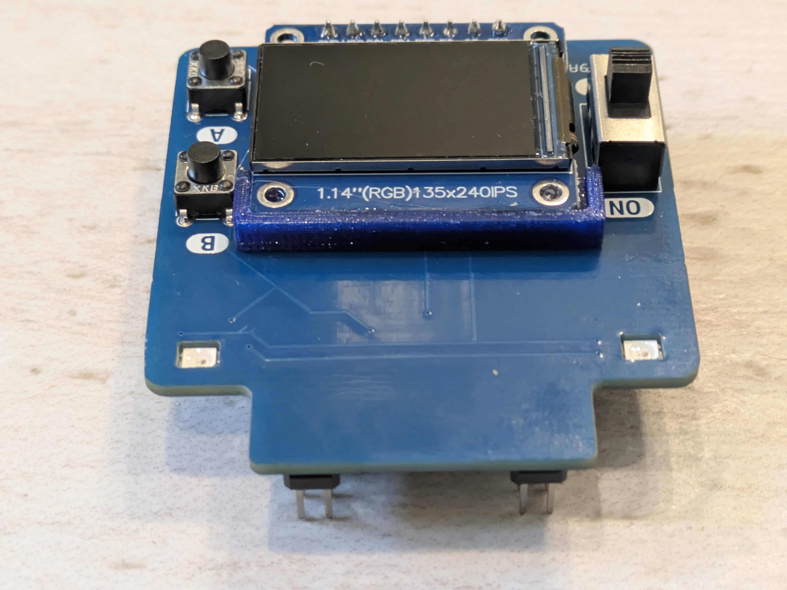

####################################
XRP display
####################################

This document describes the XRP display, an add-on board for `XRP robot <https://experientialrobotics.org/>`__

Below are the key features of this board.

* Plugs into the headers on XRP controller (warning: this doesn't work with Beta version!)
* provides a 135x240 color TFT display, using SPI bus of the XRP controller
* provides two addressable RGB LEDs (Neopixels)
* two user buttons 
* a power switch
* comes with an easy to use micropython library

All board design files and software are available from |github| under an open source license. 

.. toctree::
    :caption: Table of Contents
    :maxdepth: 1

    assembly
    usage
  
