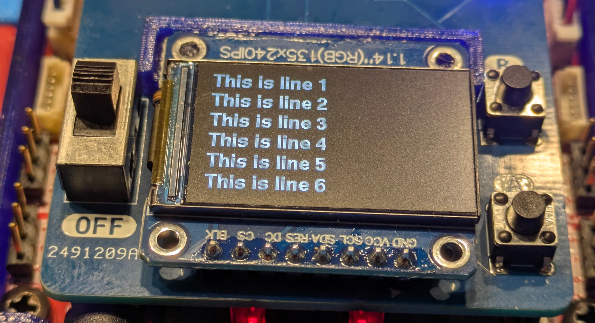

#################
Usage
#################

Attaching to XRP controller
############################
To attach the bord  to XRP controller, put the switch on the controller in "off" position. 
Connect all motors, servos, and sensors you intend to use to XRP controller. It is also advisabe to unplug 
the battery cable. 

Plug the board into the headers on the controller as shown in the photos. Make sure they 
are aligned and not off by one. When plugging in, you might need to push hard - but never push 
on the display itself.  

After plugging in, you can reconnect the battery and turn the switch on the board to "on"; switch on the 
controller should stay in off position.

Software installation
######################

Software is based on `st7789 display driver <https://github.com/easytarget/st7789-framebuffer>`__ 
by `Owen Carter <https://github.com/easytarget>`__. 

To install the software, download all files in `software/lib` folder of the |github| and copy them 
to /lib folder of your XRP controller (I use Thonny edtor for that). 

Now run `displaytest.py` file for demonstration of the board capabilities. This file is amply commented, 
making it easy to modify. 

Library reference
#################

To use the display in your own micropython code, use the commands below 

Initialization
--------------

To initialize the display, put this in the beginning of your code:

.. code-block:: python

   import xrpdisplay
   d = xrpdisplay.XrpDisplay()

All functions below will be methods of object `d`. 

Neopixels
---------

.. function:: set_leds(lcolor, rcolor)

   Sets the colors of the two Neopixel LEDs. `lcolor` sets the color of left LED, and `rcolor`, 
   of the right one.  `rcolor` is optional; if omitted, both LEDs are set to the same color. 
   Each color should be a triple of numbers ranging 0-255, desribing intensity of red, green, and blue LEDs, e.g. 
   `d.set_leds( (64, 0, 0 ) )` to set both LEDs red. 

   Note: it is recommended that you only use values 0-64 for each color intensity; even that is quite bright. 
   Using intensity of 255 woudl make the LEDs blindingly bright. 

Buttons
-------

.. function:: wait_for_button()

   Waits until user presses and releases one of the buttons. Returns button index: 1 for button A, 2 for button B. 

.. function:: is_button_pressed(button)

   Returns true if the corresponding button is pressed and false otherwise. `button` must be one of `d.buttonA`, `d.buttonB`. 

Display: basic operations
--------------------------       

.. function:: clear()

   Clears display, filling it with black pixels. 

.. function:: write_line(i, text, font = None, fg = None)

   Writes text on i-th line of display (i ranges 1--6). The text can be split into several lines using `\n` escape sequence. 
   For example, `wrte_line(2, 'press button \n to continue')` will write `press button` on line 2 and `to continue` on line 3. 
   This function automatically cleares these lines before writing new text. 

   Arguments `font` and `fg` (foreground color) are optional; if omitted, it will use default font (`d.smallfont`, 
   which is Helvetica bold) and white color. Other possible fonts are `d.smallfont2` (PT Sans Narrow_24), similar in size to the default 
   font but slightly more narrow, and `d.largefont` (PT Sans Narrow_32), a larger font. Note that `d.largefont` is taller than line 
   height, so using e.g. `d.write_line(2, "some text", font = d.largefont)` will actually get into the space reserved for line 3 as well as 2. 
   You might need to manually clear line 3 (by using `d.write_line(3,'')`) if it was non-empty. 

   Argument `fg` should be a color in RGB565 encoding; note that this is different 
   from the triple of values used for Neopixel colors -- these are not interchangeable. The library contains several predefined colors: 
   BLACK, DARKGREY, NAVY, BLUE, GREEN, TEAL,AZURE, LIME, CYAN, MAROON, PURPLE, OLIVE, GREY, SILVER, RED, ROSE, MAGENTA,ORANGE,YELLOW,WHITE
   (all are properties of xrpdisplay object, e.g. `d.BLACK`).

Display: advanced 
------------------

When the above functions are not enough, you can use all graphics methoids of micropythin `framebuffer` class with `d.display` object, for example 
`d.display.rect(0,0,40,40, d.RED)`. Full list of supported framebuffer methods can be found at https://docs.micropython.org/en/latest/library/framebuf.html. 
Note that you will need to call `d.display.show()` to make the display show graphics constructed in this way (unlike `write_line` command that doesn't 
require that).

You can also place text in any position on screen, using `write()` method with any of the fonts (`d.smallfont`, `d,smallfont2`, `d.largefont`), 
e.g. 

.. code-block:: python

   d.largefont.write(20, 30, "Welcome!", fg = d.YELLOW)
   d.display.show()

Full documentation of `write()` method can be found at https://github.com/easytarget/microPyEZfonts/blob/main/WRITER.md
As before, you will need to call `d.display.show()` to make these texts appear on screen. 

